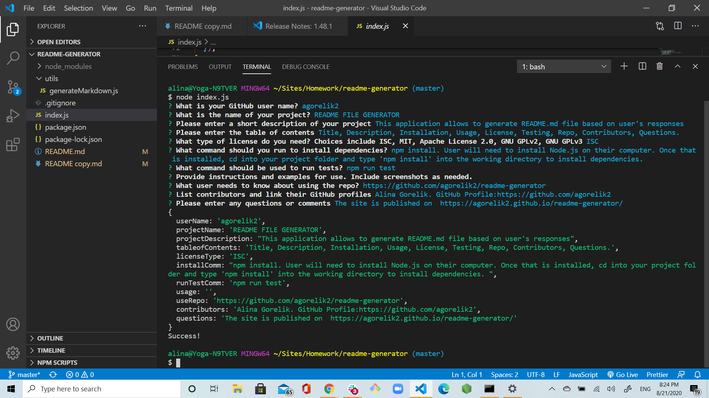
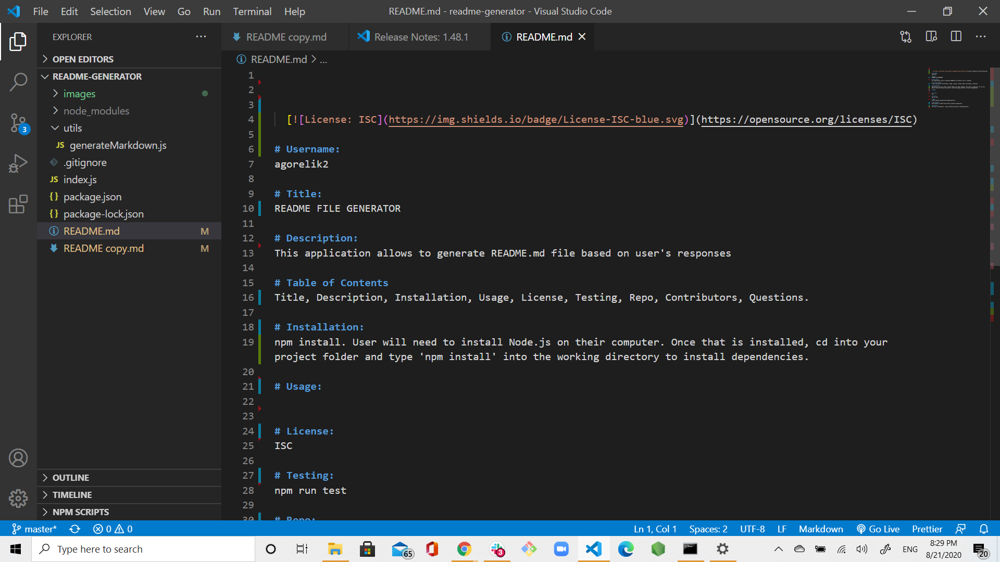
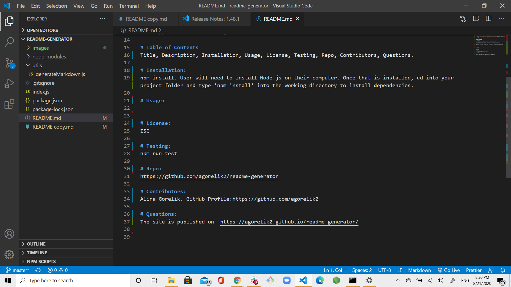

# Username:

agorelik2

# Title:

README FILE GENERATOR

# Description:

This application allows to generate README.md file based on user's responses

# Table of Contents

Title, Description, Installation, Usage, License, Testing, Repo, Contributors, Questions.

# Installation:

<<<<<<< HEAD
npm install. User will need to install Node.js on their computer. Once that is installed, cd into your project folder and type 'npm install' into the working directory to install dependencies.
=======
User will need to install Node.js on their computer. Once that is installed, cd into your project folder and type 'npm install' into the working directory to install dependencies. User will also need to install npm file system and npm inquirer.
>>>>>>> a2e0a27e98324f31ed7c2ae9b81657bb167d1b77

# Usage:

In terminal, CD into the project directory. Type node index.js to run the program. User will be presented with the series of questions, and a README.md file will be generated based on user's answers.

## Pictures of Readme File Generator

# License:

ISC

# Testing:

npm run test

# Repo:

https://github.com/agorelik2/readme-generator

# Contributors:

Alina Gorelik. GitHub Profile:https://github.com/agorelik2

# Questions:

The site is published on https://agorelik2.github.io/readme-generator/
